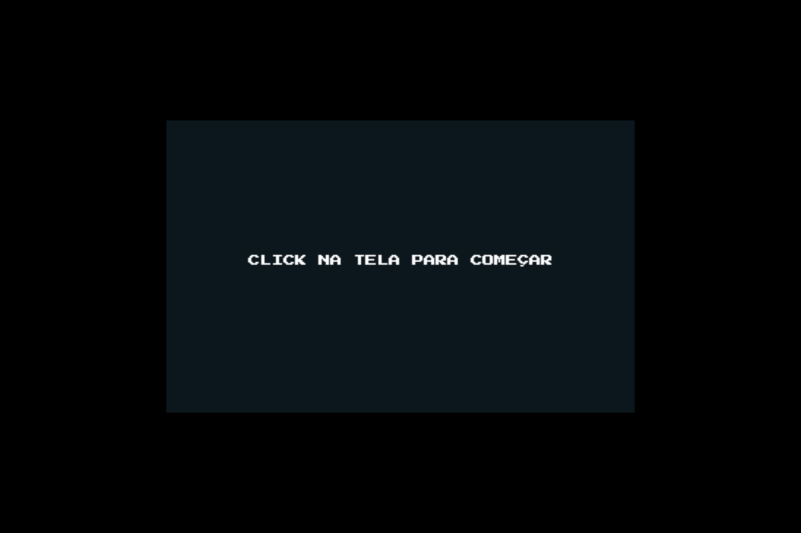
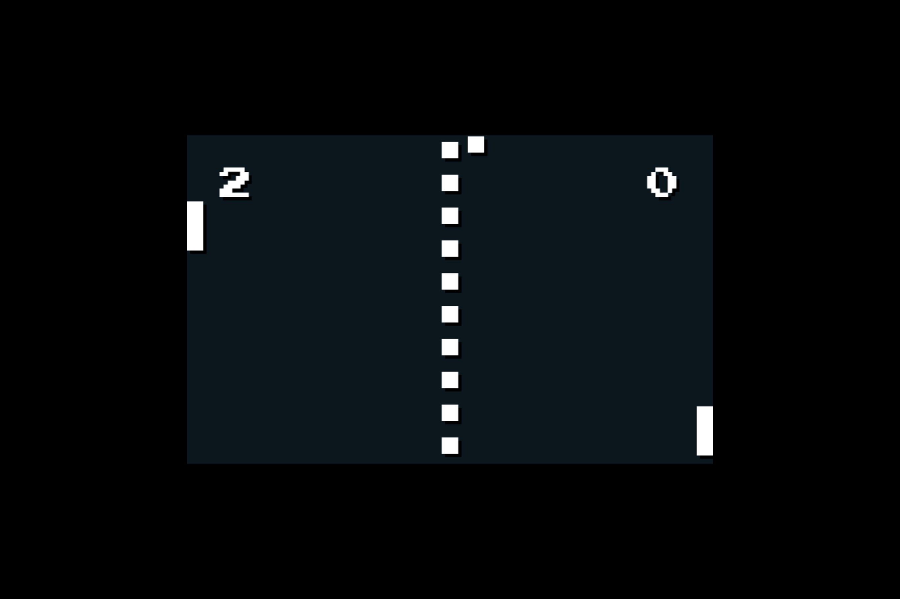

<h1 align='center'>Ping-Pong</h1>

<h2>Aviso</h2>

Os arquivos .ts não estão compilados, então você tera que compilá-los antes de abre o index.html. era so isso :)

<h2>Imagens</h2>

  
imagem da tela de start

  
   
imagem do jogo

  

